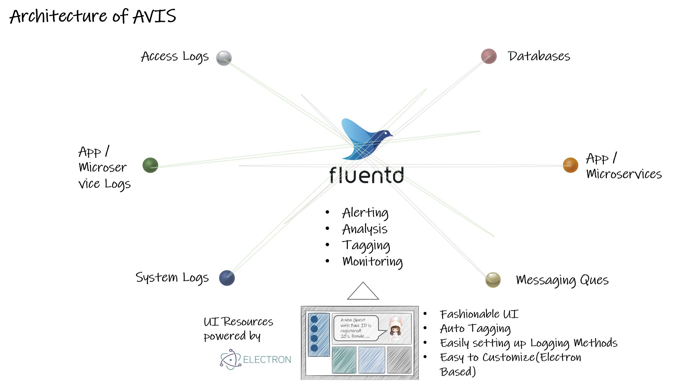
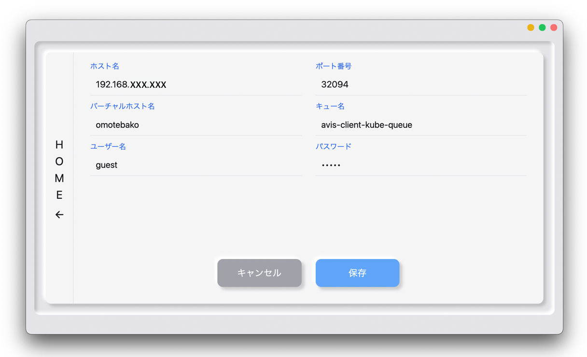

# avis-electron

avis-electron は、Fluentdを用いてマイクロサービスログやアクセスログ、システムログ等を収集し、収集されたログから重要なログをピックアップしてUI上に表示する、[avis](https://github.com/latonaio/avis)のUIフロントエンドリソースです。  
当該リソースはElectron をベースとしており、カスタマイズが容易で、直感的で洗練されたUIを実現します。  
Electronは、macOS、Windows、Linuxといったクロスプラットフォームに対応したデスクトップアプリを開発することができる、GitHubが開発したオープンソースのフレームワークです。  

## avis-electron を使用した Avis の アーキテクチャ  

## avis-electron を使用した Avisの Frontend UI  
Avis の Frontend UI リソース は、デスクトップPCやフロントエンド用のサーバで動作します。  
Avis は、収集されたログから重要なログをピックアップして、UI上に分かりやすく表示します。  

## Avisの設定画面
Avis の 設定画面 では、以下の項目を設定します。  
本設定で設定された対象のホスト（エッジデバイス等）から、ピックアップされたログを表示します。  

* ホスト名：接続するNWホストのIP（現在、単一ノードにしか対応していません。複数ノード対応は開発中です）  
* ポート番号：接続するNWホストのポート番号  
* バーチャルホスト名：バーチャルホストの名称  
* キュー名：ホスト側における RabbitMQ のキュー名  
* ユーザー名：ホスト接続時のユーザ名  
* パスワード：ホスト接続時のパスワード  

